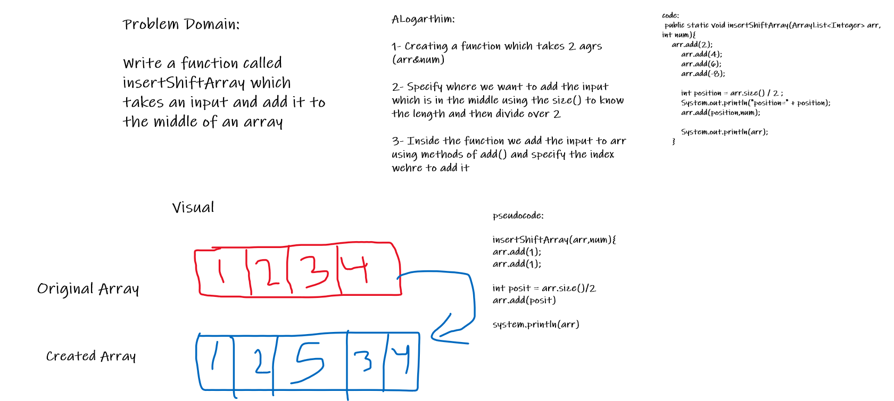

The soltuion for the second code challenge of insert Shift Array

The code:

public static void main(String[] args){

int num = 5;
ArrayList< Integer> arr = new ArrayList< Integer>(); 
insertShiftArray(arr , num);
}

public static void insertShiftArray(ArrayList< Integer> arr, int num){

arr.add(2); 
arr.add(4); 
arr.add(6); 
arr.add(-8); 
arr.add(10);

        int position = arr.size() / 2 ;
        System.out.println("position=" + position);
        arr.add(position,num);
        System.out.println(arr);

    }
